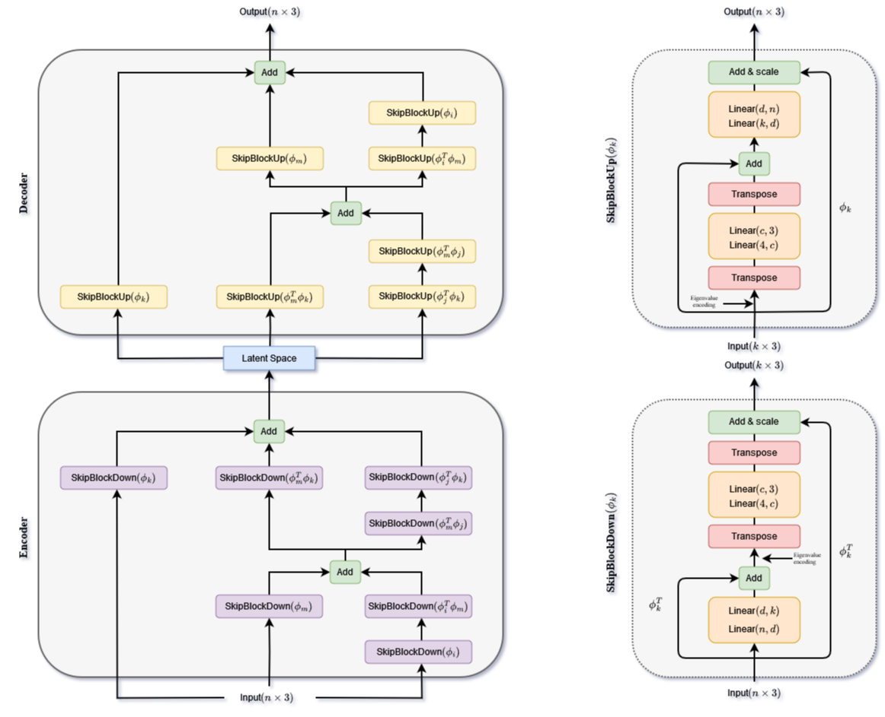

# SDL_skip




Tested with Python 3.10.13 and Anaconda on Windows 10

Commands to install requirements in Anaconda:
```
conda install pytorch==1.12.0 torchvision==0.13.0 torchaudio==0.12.0 cudatoolkit=11.6 -c pytorch -c conda-forge
conda install pandas
conda install -c anaconda scikit-learn
conda install -c conda-forge plyfile
conda install pyg -c pyg
```

Model can be trained by running main.py.
Depending on the data we recommend running procrustes_ply(Data,folder) from utilis beforehand to align the data.
Eigenvalues and eigenvecors should also be calucalted beforehand. Use spectral_decomp.py to achieve that.
